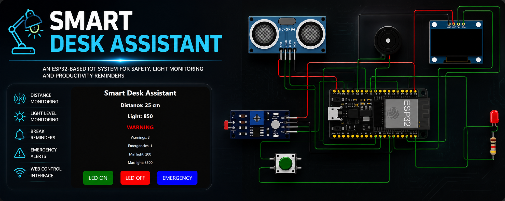

````md
# Smart Desk Assistant



## 📌 About The Project

**Smart Desk Assistant** is an ESP32-based IoT system designed to improve workspace safety and productivity.

The project combines multiple sensors, web monitoring, OLED visualization, emergency alerts, and smart lighting into one compact assistant.

---

## 🚀 Features

- 📏 Distance monitoring using HC-SR04
- 💡 Automatic light detection with LDR
- 🔔 Buzzer warning system
- 🚨 Emergency mode
- 🌙 Night light mode
- 🖥 OLED real-time display
- 🌐 Web control interface
- 🔘 Physical emergency button
- ⏰ Break reminders
- 📊 Statistics tracking

---

## 🛠 Components Used

| Component | Description |
|---|---|
| ESP32 | Main microcontroller |
| HC-SR04 | Distance sensor |
| OLED SSD1306 | Display module |
| LDR Sensor | Light sensor |
| Buzzer | Audio alerts |
| LED | Status lighting |
| Push Button | Emergency trigger |

---

## 🌐 Web Interface

The ESP32 hosts a local web server where users can:

- View distance and light data
- Monitor warning status
- Turn LED on/off
- Activate emergency mode
- Track warning statistics

---

## 📷 Preview

### Circuit Diagram


### Web Dashboard


---

## ⚙️ Pin Configuration

| Device | ESP32 Pin |
|---|---|
| HC-SR04 Trigger | GPIO 5 |
| HC-SR04 Echo | GPIO 18 |
| Buzzer | GPIO 26 |
| LED | GPIO 27 |
| LDR | GPIO 34 |
| Button | GPIO 14 |
| OLED SDA | GPIO 21 |
| OLED SCL | GPIO 22 |

---

## 🔥 System Logic

### Warning Mode
If an object is detected closer than **30 cm**:
- LED turns ON
- Buzzer activates
- OLED shows WARNING
- Warning counter increases

### Night Mode
If the room becomes dark:
- LED automatically turns ON

### Emergency Mode
Can be activated:
- From the website
- Using the physical button

The system:
- Flashes LED
- Activates buzzer
- Shows emergency message on OLED

---

## 📡 WiFi Access

```cpp
const char* ssid = "Wokwi-GUEST";
const char* password = "";
````

After connection, open the ESP32 IP address in a browser.

---

## 🧠 Technologies Used

* Arduino C++
* ESP32 WiFi
* HTML/CSS
* Adafruit SSD1306
* WebServer Library

---

## ▶️ How To Run

1. Connect all components
2. Upload the code to ESP32
3. Connect to WiFi
4. Open Serial Monitor
5. Copy ESP32 IP address
6. Open it in browser

---

## 📄 License

This project is open-source and available under the MIT License.

---

## 👨‍💻 Author

Developed as an IoT smart workspace assistant project using ESP32.

```
```
